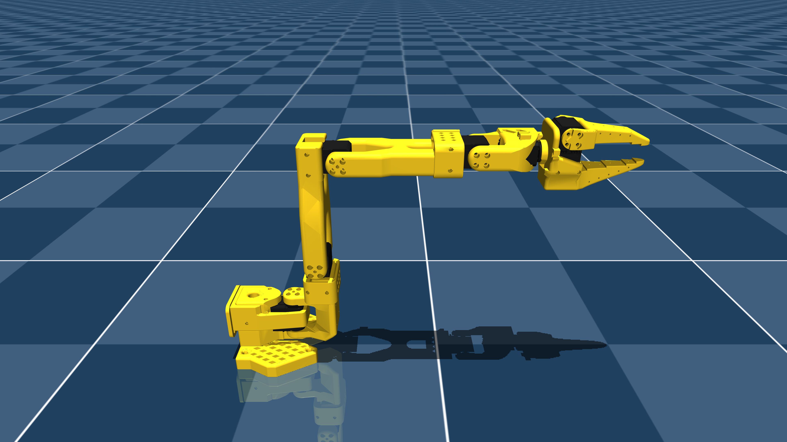

# Sim_Mujoco_SO101

Modelo MJCF del brazo robótico **SO-101** (The Robot Studio / SO-ARM100) para
simulación en [MuJoCo](https://mujoco.org), con escenas listas para usar.

<p float="left">
  
</p>

## Contenido

```
├── pyproject.toml     # dependencias del proyecto
├── uv.lock            # versiones exactas (no editar a mano)
├── wasd.py            # control del brazo con el teclado
└── models/so101/
    ├── so101.xml      # el brazo: árbol cinemático, juntas, actuadores
    ├── scene.xml      # escena básica (piso + luz + brazo)
    ├── scene_box.xml  # escena con un cubo libre y un keyframe de agarre
    ├── scene_ik.xml   # escena con objetivo mocap para IK y cubo agarrable
    ├── assets/        # 19 mallas STL (visuales y de colisión)
    ├── so101.png      # render de referencia
    ├── README.md      # procedencia del modelo y pasos de derivación
    ├── CHANGELOG.md
    └── LICENSE        # Apache 2.0
```

## Instalación

El repo se gestiona con [`uv`](https://docs.astral.sh/uv/). Las dependencias y
sus versiones exactas están fijadas en `pyproject.toml` y `uv.lock`, así que la
instalación es un solo comando y a todos les toca la misma versión de MuJoCo.

```bash
# 1. instalar uv (una sola vez)
curl -LsSf https://astral.sh/uv/install.sh | sh     # macOS / Linux
# Windows (PowerShell):
#   powershell -c "irm https://astral.sh/uv/install.ps1 | iex"

# 2. clonar y sincronizar
git clone https://github.com/strahlenguy/Sim_Mujoco_SO101.git
cd Sim_Mujoco_SO101
uv sync
```

`uv sync` crea el entorno `.venv/` y resuelve el lock. No hace falta activar
nada: todo se ejecuta con `uv run`.

Dependencias: `mujoco` (≥3.1.3, verificado con 3.12.0) y `numpy`. Python ≥3.10.

## Uso rápido

```bash
uv run mjpython -m mujoco.viewer --mjcf=models/so101/scene.xml   # macOS
uv run python   -m mujoco.viewer --mjcf=models/so101/scene.xml   # Linux / Windows
```

Otras escenas: `--mjcf=models/so101/scene_box.xml` o `scene_ik.xml`.

En la ventana, **Tab** (o el botón `>`) abre el panel lateral; en la pestaña
**Control** hay un slider por junta.

Desde código:

```python
import mujoco

model = mujoco.MjModel.from_xml_path("models/so101/scene.xml")  # compila el XML
data  = mujoco.MjData(model)                                     # estado

data.ctrl[0] = 0.5              # consigna del servo shoulder_pan, en radianes
for _ in range(200):
    mujoco.mj_step(model, data) # 200 pasos × 5 ms = 1 s de simulación

print(data.qpos)                # posiciones articulares resultantes
```

Guardado como `prueba.py`, se ejecuta con `uv run prueba.py`.

Se carga siempre una **escena**, nunca `so101.xml` directamente: cada escena hace
`<include file="so101.xml"/>` y le añade piso, luz y objetos. MuJoCo fusiona ambos
archivos en un solo modelo al compilar.

### Control con el teclado (`wasd.py`)

```bash
uv run mjpython wasd.py     # macOS
uv run python   wasd.py     # Linux / Windows
```

Mueves un punto en el espacio y el brazo lo persigue resolviendo cinemática
inversa. 86 líneas, sin dependencias más allá de las del repo.

| Tecla | Acción | Tecla | Acción |
|---|---|---|---|
| `W` / `S` | adelante / atrás | `O` / `C` | abrir / cerrar la pinza |
| `A` / `D` | izquierda / derecha | `R` | volver a la pose inicial |
| `Q` / `E` | arriba / abajo | | |

Cada ciclo calcula el jacobiano del TCP y da un paso de mínimos cuadrados
amortiguados hacia el objetivo. El detalle que importa: la IK se resuelve sobre
una copia **cinemática** del estado (`mj_kinematics`, sin física), no sobre la
posición real del brazo. Si se hace sobre la real, el retraso del servo se
integra en la consigna y el brazo se va de largo.

### macOS: `mjpython` y el parche de `libpython`

Solo aplica en macOS. En Windows y Linux basta `uv run python`.

En macOS el visor tiene que correr en el hilo principal, así que MuJoCo trae el
lanzador `mjpython` (sustituto directo de `python`, admite los mismos flags).
Los scripts sin ventana van con `uv run python` normal.

Con entornos creados por `uv` hay un fallo conocido
([mujoco#1923](https://github.com/google-deepmind/mujoco/issues/1923)):
el CPython *standalone* de `uv` guarda la `libpython` en su propio directorio,
pero `mjpython` la busca dentro de `.venv/lib/`.

```
failed to dlopen path '.../.venv/bin/python':
  Library not loaded: @executable_path/../lib/libpython3.12.dylib
```

Se arregla con un enlace simbólico, leyendo del propio entorno dónde vive:

```bash
VER=$(awk -F' = ' '/^version_info/{print $2}' .venv/pyvenv.cfg | cut -d. -f1,2)
PYHOME=$(awk -F' = ' '/^home/{print $2}' .venv/pyvenv.cfg)
mkdir -p .venv/lib && ln -sfn "${PYHOME%/bin}/lib/libpython$VER.dylib" ".venv/lib/libpython$VER.dylib"
```

Hay que rehacerlo cada vez que `uv` recree el `.venv`.

## Cómo está construido el modelo

**El árbol cinemático es el anidamiento del XML.** No hay una lista de juntas
aparte como en URDF: cada `<body>` anidado es un eslabón hijo, su `pos`/`quat` son
relativos al padre, y el `<joint>` que contiene describe el grado de libertad
entre ese eslabón y su padre.

```
world → base → shoulder → upper_arm → lower_arm → wrist → gripper → moving_jaw
                   │           │           │         │        │          │
              shoulder_pan  shoulder_lift  elbow  wrist_flex wrist_roll gripper
```

Seis juntas `hinge`, seis actuadores → `nq = nv = nu = 6`. La pinza es una mordaza
móvil girando contra una fija; no hay cadenas cerradas.

| Junta | Rango (rad) |
|---|---|
| `shoulder_pan`   | −1.91986 … 1.91986 |
| `shoulder_lift`  | −1.74533 … 1.74533 |
| `elbow_flex`     | −1.69 … 1.69 |
| `wrist_flex`     | −1.65806 … 1.65806 |
| `wrist_roll`     | −2.74385 … 2.84121 |
| `gripper`        | −0.17453 … 1.74533 (negativo = cerrada) |

**Geometría dual.** Cada eslabón lleva mallas STL sólo para dibujar
(`class="visual"`, con `contype=0 conaffinity=0`, invisibles a la física) y
primitivas baratas para chocar (`class="collision"`: cajas, esferas, cápsulas).
En el visor se alternan con las teclas `0`–`4`. La pinza usa una clase aparte
(`collision_gripper`) con `condim="6"` y `priority="1"`, afinada para que los
agarres no se resbalen.

**Actuadores de posición.** Los seis son `<position>` con las ganancias del servo
STS3215 (`kp=998.22`, `kv=2.731`, `forcerange=±2.94 N·m`), agrupadas en la clase
`sts3215`. Un `<position>` es un servo PD interno: aplica
`kp·(ctrl − qpos) − kv·qvel`. Por eso **`data.ctrl[i]` es una consigna, no una
posición impuesta** — la junta puede quedarse corta bajo carga, igual que el
servo real.

**Marcos útiles.** El `<site name="gripperframe">` marca el TCP (punto de agarre)
para cinemática directa e inversa; `<site name="baseframe">` marca el origen del
robot. La cámara `wrist_cam` va montada en la muñeca con parámetros ópticos
físicos (`focal`, `sensorsize`).

**`scene_ik.xml`** añade un `<body name="target" mocap="true">`: un cuerpo sin
física que se mueve escribiendo `data.mocap_pos` o arrastrándolo con el ratón,
pensado como objetivo cartesiano para resolver IK.

**`scene_box.xml`** añade un cubo con `<freejoint/>`. Ojo con los índices: un
cuerpo libre ocupa 7 valores en `qpos` (3 de posición + 4 de cuaternión) pero 6 en
`qvel`, así que en esa escena `nq = 13` y `nv = 12`.

## Procedencia y licencia

El modelo deriva de
[TheRobotStudio/SO-ARM100](https://github.com/TheRobotStudio/SO-ARM100/tree/main/Simulation/SO101)
(`so101_new_calib.xml`), con las modificaciones descritas en
[`models/so101/README.md`](models/so101/README.md): geometrías primitivas de
colisión, parámetros del solver ajustados para manipulación, integrador
`implicitfast` y soporte de cámara.

Publicado bajo la [Apache License 2.0](models/so101/LICENSE), la misma del
modelo original.
